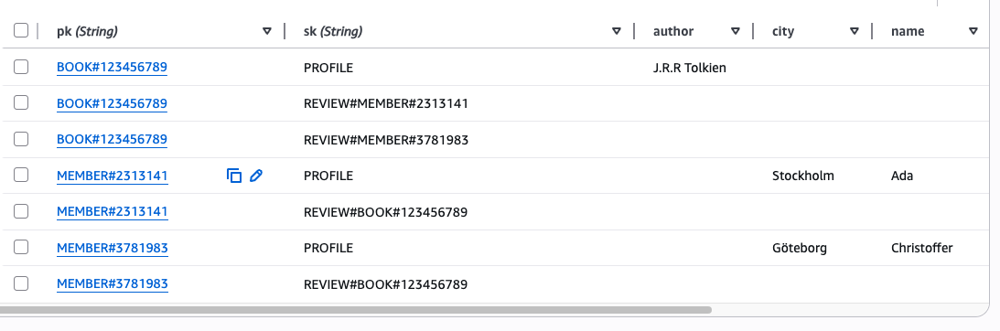
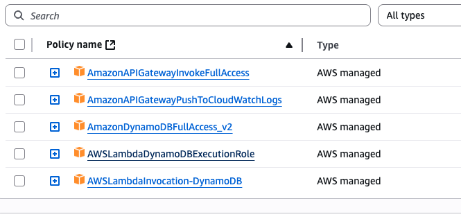

# Live 9 september

Dagens kodexempel från lektionen. För att köra det så ändra rollen i serverless.yml till en egen roll från ditt AWS konto och kör sedan kommandot serverless deploy.

Testa gärna med att lägga till en lamda-funktion som heter `getReviewsByMember` som hämtar alla recensioner från en medlem. Du kan hämta inspiration från `getReviewsByBook`.

Databasmodell:

Behörigheter i IAM:

